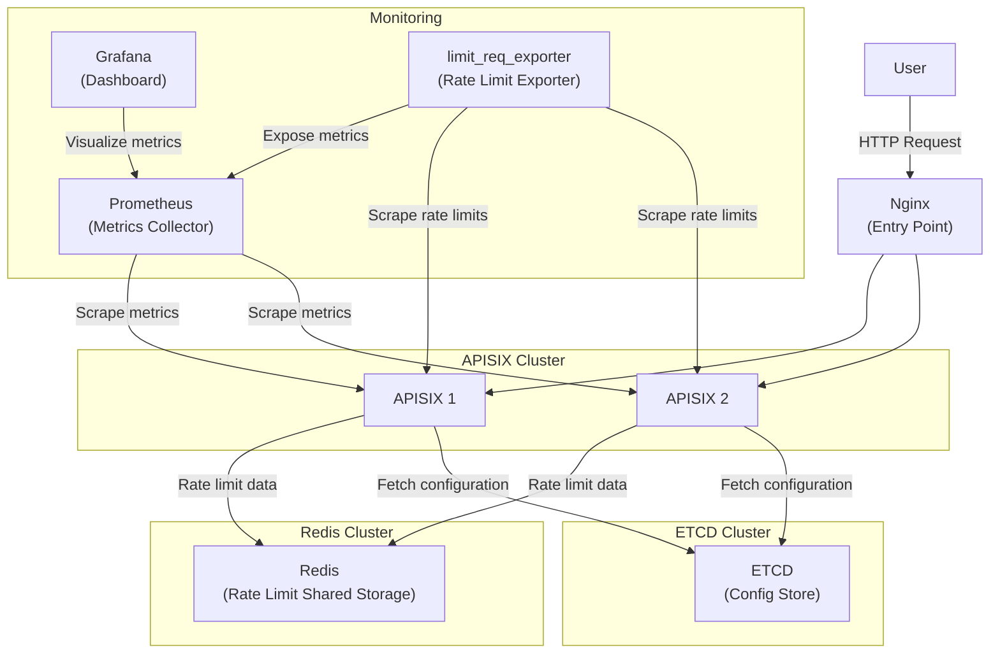

# apisix docker compose

apisix gateway docker compose

## 개발환경

`.env-sample` 참고하여 개인 설정에 맞는 `.env` 정의가 필요합니다.

**`ADMIN_API_KEY=edd1c9f034335f136f87ad84b625c8f1`는 반드시 apisix config file(apisix1.yaml, apisix2.yaml)의 admin key와 동일하게 세팅이 필요합니다.**

## 구성

현재 redis cluster와 ETCD cluster에는 single redis, single ETCD로 구성되어있습니다.

- `nginx` : user의 HTTP request를 round robbin으로 apisix * 2에 전달합니다.
- `apisix` : gateway로써 라우팅정보를 바탕으로 받은 요청을 upstream으로 전달합니다. java plugin을 실행하기 위해서 기존 `apache/apisix:3.11.0-debian`이미지에 java를 설치한 이미지를 사용하버니다.
- `redis` : rate limit을 공유하기 위한 storage로 사용됩니다.
- `etcd` : apisix의 설정정보를 공유하기위한 storage입니다.
- `prometheus` : metric 수집 및 저장하는 TSDB입니다.
- `limit_req_exporter` : apisix의 라우터들의 rate limit 정보를 scrap하여 prometheus에 metric을 저장합니다.
- `grafana` : 수집된 metric정보를 시각화 하는 dashboard입니다.



### apisix plugin

- `active_health_control.lua` : apisix에서 라우팅되는 upstream을 active 방식으로 health check하는 plugin 입니다.
- `utli.lua` : 기존 util.lua를 ovveride하는 plugin입니다. 현재 dynamic_throttling plugin이 rate limit을 변경하면서 `modifiedIndex`의 값에 따라서 생기는 redis에 rate limit 관련 key에 대해 ttl을 추가하기 위한 plugin 입니다.
  - rate limit 관련 redis key : `limit_req:{routeId}route{modifiedIndex}excess`, `limit_req:{routeId}route{modifiedIndex}last`
- `apisix-demo-jar-with-dependencies.jar` : `ext-plugin-pre-req` 으로써 springboot로 작업되어있습니다. header 체크를 한다던지의 추가 기능을 수행할 수 있습니다.
  - route 설정시 PluginFilter 이름과 동일하게 설정합니다.
    - route 설정
      ```json
      "ext-plugin-pre-req":{
        "conf":[
          {
            "name":"DemoFilter",
            "value":""
          }
        ]
      }
      ```
    - spring PluginFilter name (**class명과는 상관없습니다.**)
      ```java
      @Override
      public String name() {
          return "DemoFilter";
      }
      ```

```shell
curl -i -X PUT http://127.0.0.1:9180/apisix/admin/routes/1 \
-H "X-API-KEY: {ADMIN_API_KEY}" \
-H "Content-Type: application/json" \
-d '{
  "uri": "/api/*",
  "plugins": {
    "prometheus":{},
    "active_health_control": {
      "health_check_enabled": true,
      "admin_api_url": "http://apisix1:9180",
      "admin_api_token": "{ADMIN_API_KEY}",
      "health_check_path": "http://{HEALTH_CHECK_FOR_HOST}/api/health",
      "expected_status": 200,
      "interval": 5
    },
    "limit-req":{
      "rate": 200,
      "burst": 20,
      "key": "route_id",
      "policy": "redis",
      "redis_host": "redis",
      "redis_port": 6379,
      "redis_timeout": 1000,
      "rejected_code": 429
    },
    "ext-plugin-pre-req":{
      "conf":[
        {
          "name":"DemoFilter",
          "value":""
        }
      ]
    }
  },
  "methods": ["GET", "POST"],
  "upstream": {
    "type": "roundrobin",
    "nodes": {
      "{UPSTREAM_HOST}:{UPSTREAM_PORT}": 1
    }
  }
}'
```

## command
### etcd 명령어 잘 되어있는지 확인

```bash
etcdctl get --prefix "/apisix/"
```

### etcd 설정 확인

```bash
etcdctl get / --prefix --keys-only --write-out=json
```

### etcd 현재 revision값 확인

```bash
etcdctl --endpoints=http://localhost:2379 endpoint status --write-out=table
```

### defrag 하기

```bash
etcdctl defrag --endpoints=http://localhost:2379
```

### 디스크 용량 확인

```bash
du -sh /bitnami/etcd/data/member
```

### route 설정 확인

```bash
curl -i -X GET http://127.0.0.1:9180/apisix/admin/routes \
-H "X-API-KEY: edd1c9f034335f136f87ad84b625c8f1"
```

### redis 값 확인

> 위에서 modifiedIndex값에 해당하는 route{id}로 잡힘. 즉, route 정보가 업데이트 된다면 이미 공유되던 ratelimit 값이 바뀜을 주의.

"limit_req:3route32last" => 1742868395840 : 마지막 요청이 처리된 타임스탬프
1) "limit_req:3route32excess" => integer : 버스트(burst) 제한을 초과한 요청 개수를 나타냄. 현재 bucket에 누적된 초과 요청 수. excess 값은 10이 됨 -> "10개의 요청이 rate+burst를 넘어서 차단됐다"는 뜻

### redis cluster 적용

route 설정 시 redis cluster를 사용하게 된다면 아래처럼 route를 구성해야합니다.

- as-is

  ```json
  "limit-req":{
    "rate": 200,
    "burst": 20,
    "key": "route_id",
    "policy": "redis",
    "redis_host": "redis",
    "redis_port": 6379,
    "redis_timeout": 1000,
    "rejected_code": 429
  }
  ```

- to-be

  ```json
  "limit-req": {
    "rate": 200,
    "burst": 20,
    "key": "route_id",
    "policy": "redis-cluster",
    "redis_cluster_nodes": [
      "redis-node-1:7001",
      "redis-node-2:7002",
      "redis-node-3:7003",
      "redis-node-4:7004",
      "redis-node-5:7005",
      "redis-node-6:7006"
    ],
    "redis_cluster": true,
    "redis_timeout": 1000,
    "rejected_code": 429
  }
  ```

### etcd cluster 적용

`apisix.yaml`에 아래 설정을 적용해야함.

```yml
deployment:
  etcd:
    host:
      - "http://etcd1:2379"
      - "http://etcd2:2379"
      - "http://etcd3:2379"
```

### etcd cluster 확인
docker exec -it etcd1 etcdctl member list

### etcd cluster 리더 노드 확인
docker exec -it etcd1 etcdctl endpoint status --write-out=table