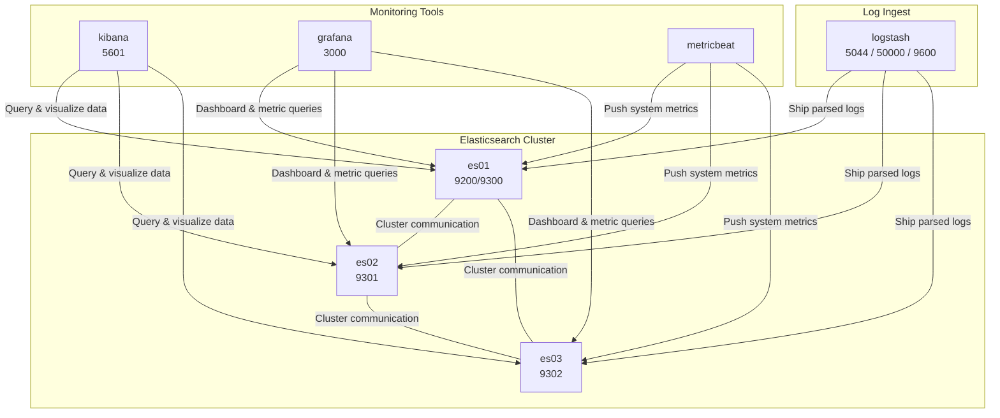

# docker-compose-elk

elk docker compose

## 개발환경

## 구성

- `es01~03`: Elasticsearch 클러스터 구성 노드 (서로 통신 및 데이터 샤딩/복제)입니다. 클러스터를 구성하며 cluster.initial_master_nodes로 초기화됩니다.
- `Kibana` : Elasticsearch에서 데이터를 시각화하는 UI입니다.
- `Grafana`	Elasticsearch를 메트릭 소스로 사용하는 dashboard입니다.
- `Metricbeat` : 시스템/컨테이너 상태를 수집해 Elasticsearch로 전송합니다.
- `Logstash` : 로그 수집 파이프라인 처리 및 Elasticsearch로 전송합니다.




es01, es02, es03은 클러스터를 구성하며 cluster.initial_master_nodes로 초기화됨.

Kibana, Metricbeat, Logstash, Grafana는 모두 Elasticsearch에 의존.

Metricbeat는 시스템/컨테이너 메트릭을 Elasticsearch로 보냄.

Grafana는 Elasticsearch를 데이터 소스로 시각화 가능.


## command

### 클러스터의 모든 노드 상태 확인

```bash
curl -X GET http://localhost:9200/_cat/nodes?v
```

### Elasticsearch 클러스터의 전반적인 health 확인

```bash
curl -X GET http://localhost:9200/_cluster/health?pretty
```

### 클러스터 내 모든 인덱스의 상태, 크기, 문서 수 등을 출력

```bash
curl -X GET http://localhost:9200/_cat/indices?v
```

### 클러스터의 영구 설정(persistent settings)을 변경

> 이 설정은 클러스터가 재시작되어도 유지됩니다. 인덱스가 존재하지 않으면 자동 생성되도록 허용하는 설정입니다. default는 `false`로 개발 편의상 `true`로 설정합니다.

```bash
curl -X PUT "http://localhost:9200/_cluster/settings" \
  -H "Content-Type: application/json" \
  -d '{
    "persistent": {
      "index.auto_create_index": "true"
    }
  }'
```
