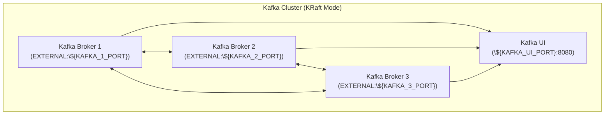

# single-cluster-with-KRaft

## 구성

```mermaid
graph TD
    subgraph "Kafka Cluster (KRaft Mode)"
        kafka1["Kafka Broker 1<br>(EXTERNAL:\${KAFKA_1_PORT})"]
        kafka2["Kafka Broker 2<br>(EXTERNAL:\${KAFKA_2_PORT})"]
        kafka3["Kafka Broker 3<br>(EXTERNAL:\${KAFKA_3_PORT})"]
        kafka-ui["Kafka UI<br>(\${KAFKA_UI_PORT}:8080)"]
    end

    kafka1 --> kafka-ui
    kafka2 --> kafka-ui
    kafka3 --> kafka-ui

    kafka1 <--> kafka2
    kafka1 <--> kafka3
    kafka2 <--> kafka3
```
