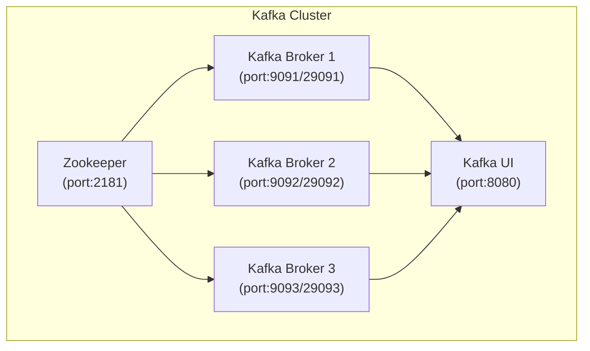

# kafka-cluster-with-zookeeper

## 구성

```mermaid
graph TD
    subgraph "Kafka Cluster"
        zookeeper["Zookeeper<br/>(port:2181)"]

        kafka1["Kafka Broker 1<br/>(port:9091/29091)"]
        kafka2["Kafka Broker 2<br/>(port:9092/29092)"]
        kafka3["Kafka Broker 3<br/>(port:9093/29093)"]

        kafka-ui["Kafka UI<br/>(port:8080)"]
    end

    zookeeper --> kafka1
    zookeeper --> kafka2
    zookeeper --> kafka3

    kafka1 --> kafka-ui
    kafka2 --> kafka-ui
    kafka3 --> kafka-ui
```

