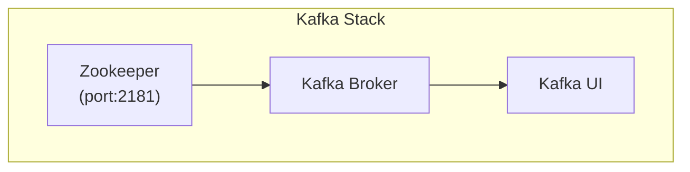

# single-kafka-with-zookeeper

## 구성

```mermaid
graph TD
    subgraph Kafka Stack
        zookeeper["Zookeeper <br/>(port:2181)"]
        kafka["Kafka Broker <br/(ports: 29092, 9092, 9101)"]
        kafka-ui["Kafka UI <br/(port: 8080)"]
    end

    zookeeper --> kafka
    kafka --> kafka-ui
```
