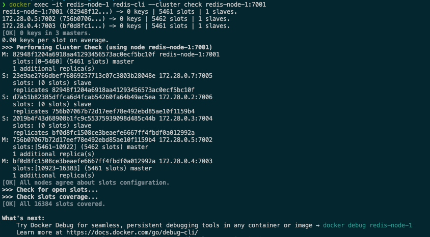

#  Redis Sentinel

이 Docker Compose 설정은 다음과 같은 Redis 고가용성(HA) 아키텍처를 구성합니다.

- Redis Master 3개
- Redis Replica 3개

`--cluster-replicas 1` 옵션을 사용하면 Redis가 master/replica 구성을 자동으로 판단해서 할당해 줍니다.

즉, 슬레이브(=replica)가 어떤 master를 따라갈지도 자동 판단하는데 다음의 기준을 가지고 판단해서 할당합니다.

- 가능한 한 서로 다른 머신/호스트에 배치하려고 시도 (하지만 도커 환경에서는 모두 같은 물리 호스트라 큰 의미는 없음)
- 각 master는 최대한 균등하게 슬롯을 분배 받음
- 각 replica는 가능한 한 자기 자신이 master가 되지 않도록 배치됨

## cluster setting
`docker compose up -d` 명령어 수행 후 클러스터 구성하는 명령어를 실행하여 redis cluster를 구성합니다.

- cluster setting command
    ```sh
    docker exec -it redis-node-1 redis-cli --cluster create \
    $(docker inspect -f '{{range .NetworkSettings.Networks}}{{.IPAddress}}{{end}}' redis-node-1):7001 \
    $(docker inspect -f '{{range .NetworkSettings.Networks}}{{.IPAddress}}{{end}}' redis-node-2):7002 \
    $(docker inspect -f '{{range .NetworkSettings.Networks}}{{.IPAddress}}{{end}}' redis-node-3):7003 \
    $(docker inspect -f '{{range .NetworkSettings.Networks}}{{.IPAddress}}{{end}}' redis-node-4):7004 \
    $(docker inspect -f '{{range .NetworkSettings.Networks}}{{.IPAddress}}{{end}}' redis-node-5):7005 \
    $(docker inspect -f '{{range .NetworkSettings.Networks}}{{.IPAddress}}{{end}}' redis-node-6):7006 \
    --cluster-replicas 1
    ```

- cluster setting result
    

cluster 구성이 어떻게 되었나는 아래의 명령어로 확인 가능합니다. (**`healthcheck.sh`**를 적절히 변겨어하여 이용해도 좋습니다.)

- cluster setting check command
    ```sh
    docker exec -it redis-node-1 redis-cli --cluster check redis-node-1:7001
    ```

- result
    

- 참고: replica 수동 지정
    replica 매칭을 직접 제어하고 싶다면, `--cluster-replicas 0`으로 만든 후 수동 replica 지정도 가능합니다.
    
    ```sh
    redis-cli --cluster add-node --cluster-slave \
    redis-node-4:7004 redis-node-1:7001

    redis-cli --cluster add-node --cluster-slave \
    redis-node-5:7005 redis-node-2:7002

    redis-cli --cluster add-node --cluster-slave \
    redis-node-6:7006 redis-node-3:7003
    ```

## environment

nothing to do.

## composition

- `redis-node-1` : Redis Master 노드1
- `redis-node-2` : Redis Master 노드2
- `redis-node-3` : Redis Master 노드3
- `redis-node-4` : Redis Replica 노드 1
- `redis-node-5` : Redis Replica 노드 2
- `redis-node-6` : Redis Replica 노드 3


## directory structure

```sh
.
├── docker-compose.yml
└── conf/
    ├── redis-node-1.conf
    ├── redis-node-2.conf
    ├── redis-node-3.conf
    ├── redis-node-4.conf
    ├── redis-node-5.conf
    └── redis-node-6.conf
```

## run
```sh
docker compose up -d
```

### redis-node-{n}.conf

각 redis 설정파일(redis-node-{n}.conf) 항목에 대한 설명입니다.

```sh
port 7001

# 클러스터 모드로 실행할지 여부를 결정
cluster-enabled yes

# 해당 노드의 클러스터 유지를 위한 설정을 저장하는 파일. 사용자가 수정하지 않음.
cluster-config-file nodes.conf

# 특정 노드가 정상이 아닌 것으로 판단하는 기준 시간. 이 시간동안 감지되지 않은 master는 replica에 의해 failover가 이뤄짐.
cluster-node-timeout 5000

# AOF(append-only file) 기능 활성화
appendonly yes

# 0.0.0.0 으로 설정하면 모든 네트워크 인터페이스에서 접근 가능. 외부 시스템이나 다른 노드들이 접속할 수 있게 허용.
bind 0.0.0.0

# 보호모드가 꺼져있으면 Redis는 비밀번호 없이도 누구나 접속 가능.
protected-mode no
```
