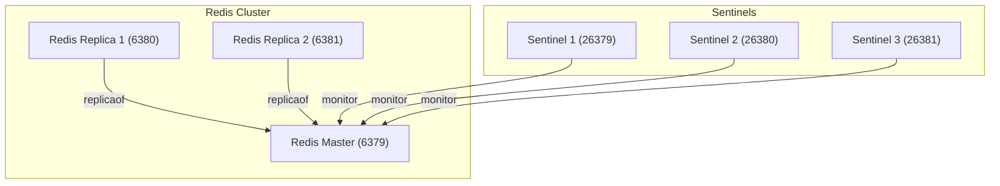

#  Redis Sentinel

이 Docker Compose 설정은 다음과 같은 Redis 고가용성(HA) 아키텍처를 구성합니다.

Sentinel은 Redis Master를 감시하고 장애 발생 시 자동으로 Replica를 승격하여 Master Failover를 수행합니다.

- Redis Master 1개
- Redis Replica 2개
- Sentinel 3개

## environment

nothing to do.

## composition

- `redis-master` : Redis Master 노드
- `redis-replica-1` : Redis Replica 노드 1
- `redis-replica-2` : Redis Replica 노드 2
- `sentinel-1` : Sentinel 인스턴스 1
- `sentinel-2` : Sentinel 인스턴스 2
- `sentinel-3` : Sentinel 인스턴스 3



## directory structure

```sh
.
├── docker-compose.yml
├── master-data/                      # Redis Master의 AOF 저장 디렉토리
└── sentinel/
    ├── sentinel-1.conf
    ├── sentinel-2.conf
    └── sentinel-3.conf
```

## run
```sh
docker compose up -d
```


굉장히 중요한 부분이 바로 sentinel resolve-hostnames yes 이부분입니다. 이게 없으면 그 다음 행에서 실행되는 sentinel monitor 명령어에서 redis-master를 찾을 수 없습니다. 여기서 redis-master는 마스터 노드의 컨테이너 이름입니다.


### sentinel.conf

- `sentinel resolve-hostnames yes`은 반드시 포함되어야합니다. 이 설정이 없으면  `sentinel monitor` 명령어에서 redis-master를 찾을 수 없습니다.

- `redis-master`는 마스터 노드의 컨테이너 이름입니다.

```sh
port 26379
sentinel resolve-hostnames yes # yes로 설정하면 Sentinel이 IP 대신 호스트 이름(DNS)을 사용해서 마스터/슬레이브를 찾음.

# mymaster : 감시할 마스터의 이름 (별명).
# redis-master : 마스터 Redis 인스턴스의 호스트명.
# 6379 : 마스터 Redis의 포트.
# 2 : 몇 개의 Sentinel이 “이 노드는 죽었다” 라고 동의해야 failover가 발생하는지 설정.
# (보통 Sentinel을 3개 띄우면 2 이상 설정)
sentinel monitor mymaster redis-master 6379 2

# Failover 판정 시간
sentinel down-after-milliseconds mymaster 5000

# Failover 후 슬레이브 동기화 동시 병렬 수. 새로운 마스터가 승격된 후, 슬레이브들은 데이터를 새 마스터로 맞춰야 함. 그때 몇 개의 슬레이브가 동시에 복제 받을지를 설정 → 1개씩 순차 동기화. 그때 몇 개의 슬레이브가 동시에 복제 받을지를 설정 → 1개씩 순차 동기화.
sentinel parallel-syncs mymaster 1

# Failover 총 제한 시간. Failover가 시작된 뒤 10초(10000ms) 안에 마스터 선출과 슬레이브 재정렬이 끝나지 않으면, 다시 처음부터 선출을 시도.
sentinel failover-timeout mymaster 10000
bind 0.0.0.0
```